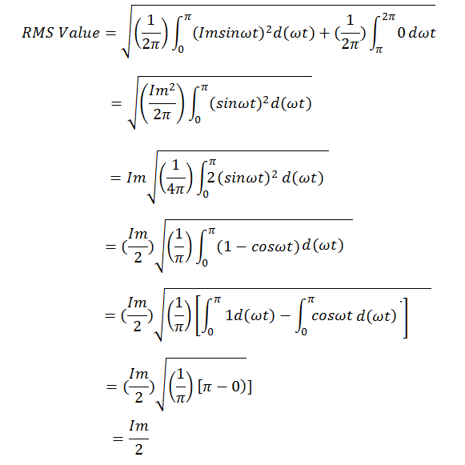

## Storyboard (Round 2)

Experiment 1: HALF WAVE RECTIFIER WITH & WITHOUT FILTERS

### 1. Story Outline:

The experiment is based on Half Wave Rectifier  which convert a single-phase supply, either the positive or negative half of the AC wave is passed, while the other half is blocked.
It is a step function (for positive pass, negativeblock): passing positive corresponds to the ramp function being the identity on positive inputs, blocking negative corresponds to being zero on negative inputs

The objective of the experiment is to study the working of half wave rectifier and calculate ripple factor. 

## 2. Story:

<b>RECTIFICATION:</b> 
The Process by which an alternating current (or voltage) is transformed into  a direct current (or voltage) is called rectification. An electrical device having a low resistance to current in one direction and a relatively high resistance  to current in the reverse direction serves as rectifier . The dynamic character of a diode is represented by rectifier .  
<b>RECTIFIER OPERATION:</b> 
The operation of a diode as a rectifier can be studied with the help of its dynamic characteristic. Let the source voltage be a sinusoidal voltage v=V0sin wt. The dynamic characteristic of the diode is in the half wave form. The sinusoidal input voltage waveform is drawn below the dynamic characteristic with the time axis vertically downwards .
The sinusoidal input voltage v has a zero average (or dc) value. But the output voltage vL has a nonzero (or dc) value since the negative half cycles are absent in the waveform of VL . Since the load current is unidirectional , the ac input voltage is converted into  a dc voltage at the output .
(A)	Half-Wave Rectifier 

Since the negative half cycles of the input voltage are cut off are absent from the output load voltage in the circuit  , which uses a single diode the circuit is referred to as the half wave rectifier . A practical half – wave rectifier circuit  uses a transformer is to step up or step down  the ac main voltage connected to its primary . The voltage at the input of the rectifier is 
v=nVpsin wt where n is the secondary -to-primary turns ratio of the transformer and Vp is the amplitude of the ac mains voltage . By adjusting n, the secondary voltage is made to suit the diode rating . The diode current flows during the positive half cycles of the input voltage.

### Formula Used:

<b>The RMS VALUE OF CURRENT:</b> 
 
                        Irms  =  Im/2 
  
<b>Average or DC value of current</b>  
  I =  Im/π 
  V =   Vm/π 
  
  ## Ripple Factor
  

#### Apparatus
1. Transformer
2. Bread Board 
3. Digital Multimeter 
4. Resistor
5. Connecting wires

### 4.User objective goals
1. To study working of half wave rectifier with or without filters
2. To calculate Ripple factor 
3. To calculate Efficiency

### 5.Challenges and Questions
##### 1.	What is Half Wave Rectifier?
  <b> a) half wave rectifier converts only half of the AC cycle to Uni-direction. </b> 
  b) half wave rectifier converts only half of the AC cycle to bi-direction.
  c) both a & b 
  d) none of the above
  ANS:-A

##### 2.What is the efficiency of a rectifier?	
  a)The ratio of AC output power to the applied AC input power is known as the efficiency of a rectifier.	
  b) The ratio of DC output power to the applied AC output power is known as the efficiency of a rectifier.
  <b> c)The ratio of DC output power to the applied AC input power is known as the efficiency of a rectifier.</b>
  d)The ratio of AC output power to the applied DC input power is known as the efficiency of a rectifier.
  ANS:-C

##### 3.What is the maximum efficiency (η) of a half wave rectifier?
  a)90.3% 
  b)93.5%	 
  c)47.3% 
  <b> d)40.6%   </b>
  ANS:-D

##### 4. What is form factor?
  a) The ratio of maximum value to the RMS value.
  <b> b)It is the ratio of the RMS value to the Average value.</b>
  c) The ratio of RMS value to the maximum value. 
  d) The ratio of average value to the RMS value.
  ANS:-B

##### 5:-What is peak factor?
  <b> a)The ratio of maximum value to the RMS value.</b> 
  b) It is the ratio of the RMS value to the Average value. 
  c) The ratio of RMS value to the maximum value.
  d)The ratio of average value to the RMS value.  
  ANS:-A

##### 6:- “Ripple voltage in a rectifier output is the amount of ……… content present in the output DC, it causes periodic pulsating of the DC voltage which is derived from the AC source.”
  <b> a)AC </b>
  b)DC
  c)both a & b  
  d) none of the above
  ANS:-A
 
##### 7:-.What is the TUF of a half wave rectifier?
  a)0.1047  
  b) 1.2222
  c)  0.0069
   <b> d) 0.2865 </b>
  ANS:-D

##### 8:-What is the importance of PIV voltage of a Diode in A Rectifier Circuit? 
  a) PIV (Peak Inverse Voltage) is the maximum possible voltage that a diode can withstand in the forward bias
  <b> b)PIV (Peak Inverse Voltage) is the maximum possible voltage that a diode can withstand in the reverse bias </b>
  c) PIV (Peak Inverse Voltage) is the minimum optimum voltage that a diode can withstand in the reverse bias.
  d) none of the above
  ANS:-B

## Application of Half Wave Rectifier
a) For rectification applications 
b) For signal demodulation applications 
c) For signal peak applications 

## Conclusion:
#### 1). A rectifier converts AC voltage to DC voltage.
#### 2). Analyze the operation of Half Wave rectifier with and without filter. 
#### 3). Calculate its performance parameters-</b> 
           a) Average or DC value 
           b) Ripple factor 
#### 4). Half wave Rectifier only passes current through load during the positive half cycle of sinusoidal.   
#### 5). The output of half wave rectifier is pulsating DC voltage, to convert it to a steady state, a filter is used.
#### 6). The effectiveness of the filter can be measured by the ripple factor.

   

